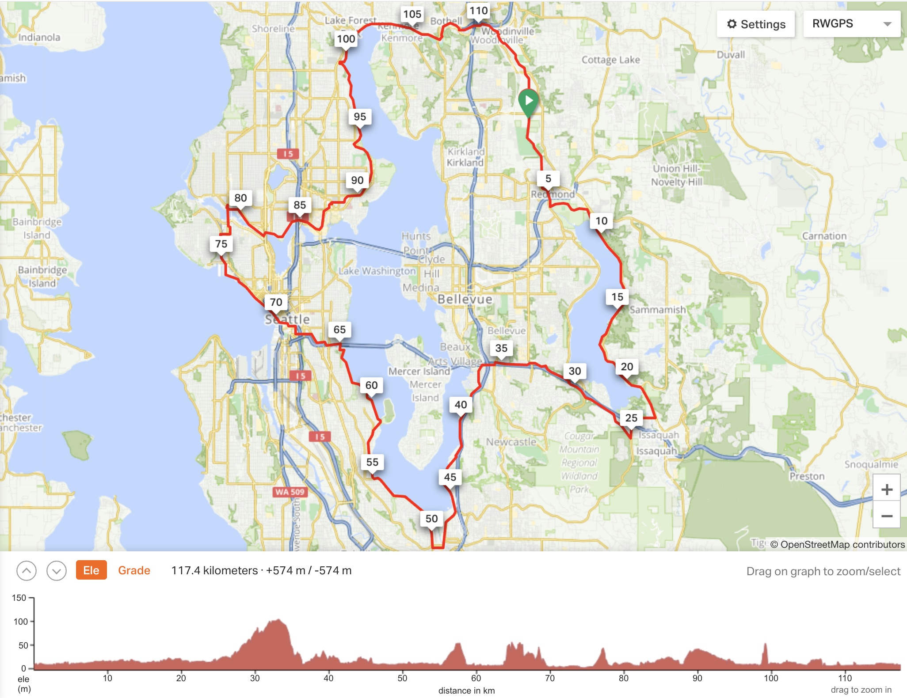

The [course for the 2019 Gran Fondue](https://ridewithgps.com/routes/28869030) is 117.4 km loop around Lake Sammamish and Lake Washington.  

It begins at Sixty Acres Park and heads south on the Sammamish River Trail to Marymoor Park.  

From Marymoor it travels south down the east side of Lake Sammamish to Issaquah.  

From Issaquah, the course climbs up Newport (the only longish climb on the ride) along I-90 to the Lake Washington trail.  

We'll head south along Lake Washington to Renton and follow the lake back north along Rainier Avenue to I-90.  

From there, we'll jump in the Mount Baker Tunnel and head west towards downtown Seattle.  

We'll stop for lunch downtown (location TBD). Once we're sufficiently refueled, we'll head north along the waterfront, through Myrtle Edwards Park to Ballard.  

In Ballard we'll hop on to the Burke-Gillman Trail and head east to UW.  

Then, still on the BGT, back around the north end of Lake Washington, through Bothell back to the Sammamish River Trail and Sixty Acres.  

The entire journey should take around 5-6 hours, including lunch and any other short stops.