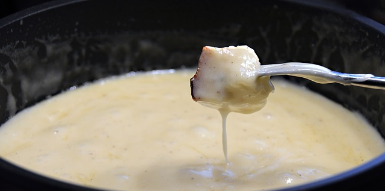

I like cycling. I like cheese, particularly when it's melted. I like friends. I like puns.  

This year I decided I wanted to bring all of these things together in one big event for my birthday.  

The Gran Fondue is a [Gran Fondo](https://en.wikipedia.org/wiki/Gran_Fondo) style ride around the Seattle area that culminates in my friends, both participants and non-riders (aka the folks who will be melting the cheese), consuming a feast of bread, cheese, wine, beer and whatever else we can think of to dip into melted cheese.

It's all happening Saturday March 2, 2019 at 10 am from Sixty Acres Park. See the [course page](/course) for details on the route.

After the ride, we'll head over to my house to consume cauldrons of bubbling hot cheese.

